## 1. Tại sao dùng SSH trên Arch? 🏹

Dân chơi Arch (I use Arch btw) thường thích sự tối giản.
Thay vì cài GPG suite nặng nề chỉ để lấy cái tick xanh **"Verified"** trên GitHub, chúng ta sẽ tận dụng chính **SSH Key** có sẵn.

- **Hiệu năng:** SSH (Ed25519) ký commit nhanh hơn GPG.
- **Tiện lợi:** Một key duy nhất cho cả Login (Push/Pull) và Signing.

## 2. Tạo SSH Key (Chuẩn Ed25519) 🔑

Mở Terminal (Alacritty, Kitty, hay WezTerm tùy bạn) và chạy:

```bash
# Thay email bằng email GitHub của bạn
ssh-keygen -t ed25519 -C "your-email@gmail.com"
```

- **Location:** Nhấn **Enter** để lưu vào mặc định `~/.ssh/id_ed25519`.
- **Passphrase:**
  - Nhập pass nếu bạn muốn bảo mật (Paranoid mode).
  - Enter 2 lần để bỏ qua (Convenience mode).

## 3. Cấu hình SSH Agent (Auto-start) 🤖

Trên Arch, `ssh-agent` không phải lúc nào cũng tự chạy. Để tránh việc gõ pass liên tục, hãy thêm đoạn này vào file config của shell (thường là `~/.zshrc` hoặc `~/.bashrc`).

**Bước 1:** Mở file config shell

```bash
nano ~/.zshrc  # Hoặc vim ~/.zshrc
```

**Bước 2:** Thêm đoạn script sau vào cuối file:

```bash
# Start SSH Agent if not running
if [ -z "$SSH_AUTH_SOCK" ]; then
   eval "$(ssh-agent -s)" > /dev/null
fi
```

**Bước 3:** Source lại file hoặc mở terminal mới, sau đó add key:

```bash
ssh-add ~/.ssh/id_ed25519
```

## 4. Upload Public Key lên GitHub ☁️

Copy public key vào clipboard (cần cài `xclip` hoặc `wl-clipboard` nếu chưa có, hoặc chỉ cần `cat` ra rồi copy tay):

```bash
cat ~/.ssh/id_ed25519.pub
# Copy chuỗi: ssh-ed25519 AAAAC3...
```

Vào [GitHub Settings > SSH and GPG keys](https://github.com/settings/keys):

### A. Add cho Authentication

1. **New SSH key** -> Title: `Arch Linux - Auth`.

2. Key type: **Authentication Key**.

3. Paste key -> Save.

### B. Add cho Signing (Quan trọng!) ⚠️

1. **New SSH key** (Lần 2) -> Title: `Arch Linux - Signing`.

2. Key type: Chọn **Signing Key**.

3. Paste key y hệt lúc nãy -> Save.

## 5. Cấu hình Git (CLI Style) ⚙️

Thay vì sửa file config thủ công, hãy dùng lệnh `git` cho chuẩn bài:

```bash
# 1. Định danh cơ bản
git config --global user.name "Your Name"
git config --global user.email "your-email@gmail.com"

# 2. Bật chế độ Sign bằng SSH
git config --global gpg.format ssh

# 3. Trỏ đường dẫn tới Public Key (Lưu ý là file .pub nhé)
git config --global user.signingkey ~/.ssh/id_ed25519.pub

# 4. Tự động Sign tất cả commit
git config --global commit.gpgsign true
```

> **Check lại file config:** Bạn có thể xem kết quả bằng lệnh `cat ~/.gitconfig`. Nó sẽ trông như thế này:

```ini
[user]
    name = Raizo
    email = raizo@archlinux.org
    signingkey = /home/raizo/.ssh/id_ed25519.pub
[gpg]
    format = ssh
[commit]
    gpgsign = true
```

## 6. Verification (Test nhân phẩm) ✅

### Test kết nối tới GitHub

```bash
ssh -T git@github.com
# Output: Hi username! You've successfully authenticated...
```

### Test Commit Verified

Tạo một commit rỗng để test:

```bash
git commit --allow-empty -m "test: arch linux verified signing"
```

Nếu không có lỗi gì văng ra -> **Success**.

### Sơ đồ luồng hoạt động

```mermaid
sequenceDiagram
    participant Arch as Arch Linux (Terminal)
    participant Agent as SSH Agent
    participant GH as GitHub

    Note over Arch, GH: Git Commit Flow
    Arch->>Arch: git commit
    Arch->>Agent: "Ê, ký dùm tao cái hash này"
    Agent-->>Arch: Trả về chữ ký số (Signature)
    Arch->>Arch: Đóng gói Commit + Signature

    Note over Arch, GH: Git Push Flow
    Arch->>GH: git push (Auth bằng Private Key)
    GH->>GH: Verify Signature bằng Public Key (Signing)
    GH-->>Arch: Hiển thị badge "Verified" ✅
```


