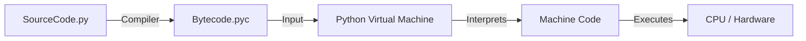

## 1. Bản chất: Compiler hay Interpreter? 🤔

Thế giới lập trình chia làm 2 phe, và Python đứng... ở giữa.

| Tiêu chí    | Trình biên dịch (C++, Go)                                 | Trình thông dịch (PHP, JS cũ)                | Python (Hybrid) 🐍                                     |
| :---------- | :-------------------------------------------------------- | :------------------------------------------- | :----------------------------------------------------- |
| **Cơ chế**  | Dịch **toàn bộ** ra mã máy (`.exe`) rồi mới chạy.         | Dịch từng dòng và chạy ngay lập tức.         | Dịch ra **Bytecode** (`.pyc`) -> PVM chạy Bytecode.    |
| **Tốc độ**  | Chạy cực nhanh (Runtime) nhưng Build lâu.                 | Chạy chậm, nhưng sửa code là chạy được ngay. | Chậm hơn C++ khoảng 10-50 lần (nếu code thuần Python). |
| **Báo lỗi** | Quét lỗi cú pháp **trước khi** chạy (Compile-time error). | Chạy đến dòng lỗi mới báo (Runtime error)    | Báo lỗi cú pháp khi tạo Bytecode, lỗi logic khi chạy.  |

### ⚙️ Under-the-hood: Code Python chạy như thế nào?



> Note: Bytecode là mã trung gian, giúp Python chạy được trên mọi hệ điều hành (Cross-platform), miễn là máy đó có cài PVM.

## 2. Các kỹ thuật Đảo ngược (Reverse) 🔄

Đi phỏng vấn mà dùng reversed() là ăn điểm tinh tế về tối ưu bộ nhớ.

| **Phương pháp** | **Cú pháp**        | **Time Complexity** | **Space Complexity** | **Notes**                                             |
| :-------------- | :----------------- | :------------------ | :------------------- | :---------------------------------------------------- |
| **Slicing**     | `new = a[::-1]`    | $O(N)$              | $O(N)$               | Tạo ra list mới (tốn RAM).                            |
| **Iterator**    | `it = reversed(a)` | $O(1)$              | $O(1)$               | **Best Choice**. Chỉ tạo con trỏ, không copy dữ liệu. |
| **In-place**    | `a.reverse()`      | $O(N)$              | $O(1)$               | Thay đổi trực tiếp list gốc.                          |

## Dictionary & The "Collections" Power

Trong Python, `dict` là **Hash Map** (O(1)) nhưng từ Python 3.7+, nó **giữ nguyên thứ tự chèn** (Insertion Order).

### 1. Dictionary Comprehension

Giống List Comprehension, nhưng dùng ngoặc nhọn `{}` và cú pháp `key: value`.

**Bài toán:** Bạn có list tên `names = ["An", "Binh", "Cuong"]`. Bạn muốn tạo dict để tra cứu độ dài tên: `{'An': 2, 'Binh': 4, ...}`.

```python
# {key: value for item in list}
d = {name: len(name) for name in names}
```

```python
original = {'a': 1, 'b': 2, 'c': 3}
# k, v là unpacking tuple
inverted = {v: k for k, v in original.items()}
print(inverted)
```

### 2. Truy cập an toàn (.get())

Trong Python, `d["key_khong_ton_tai"]` sẽ ném lỗi **KeyError** làm crash chương trình. Vậy nên chúng ta sẽ sử dụng method `.get()` để tránh việc đó.

```python
# d.get(key, default_value)
print(user_data.get("age", 0))
```

### 3. Module collections

#### A. Counter (Đếm tần suất)

```python
from collections import Counter
s = "hello world"
count = Counter(s)
# Output: Counter({'l': 3, 'o': 2, 'h': 1, ...})

# Tính năng bá đạo: Lấy 3 phần tử xuất hiện nhiều nhất
print(count.most_common(3))
```

#### B. defaultdict (Dictionary mặc định)

Khắc phục sự phiền toái khi phải kiểm tra "key đã tồn tại chưa" trước khi append vào list.

**Bài toán:** Gom nhóm các file theo đuôi mở rộng. List file: `['img.png', 'doc.txt', 'pic.png']`. Mong muốn: `{'png': ['img.png', 'pic.png'], 'txt': ['doc.txt']}`.

```python
from collections import defaultdict

# Khai báo: Nếu key chưa có, tự động tạo ra một list rỗng []
files_by_ext = defaultdict(list)

files = ['img.png', 'doc.txt', 'pic.png']
for f in files:
    ext = f.split('.')[-1]
    # Không cần if ext in files_by_ext, cứ append thẳng tay
    files_by_ext[ext].append(f)

print(dict(files_by_ext))
```

## Tạo Virtual Environment (venv)

```bash
# Tạo thư mục môi trường ảo tên là .venv
python -m venv .venv
```

### Kích hoạt (Activate)

Sau khi kích hoạt, bạn sẽ thấy `(.venv)` hiện ở đầu dòng lệnh.

#### Command Prompt (cmd):

```cmd
.venv\Scripts\activate.bat
```

#### PowerShell:

```powershell
.venv\Scripts\Activate.ps1
```

_(Nếu bị lỗi policy, chạy `Set-ExecutionPolicy -ExecutionPolicy RemoteSigned -Scope CurrentUser` trước)._

#### Git Bash (trên Windows) và Terminal trên Linux:

```bash
source .venv/Scripts/activate
```

## @dataclass (Tự động hóa Class)

- **Là gì:** Một decorator giúp tự động sinh ra các hàm `__init__`, `__repr__` (tương tự `ToString`), `__eq__` (so sánh bằng) cho class.

- **Trong C++:** Nó giống như `struct` nhưng xịn hơn, hoặc một Class POJO (Plain Old Java Object) chỉ dùng để chứa dữ liệu.

- **Ví dụ:**
  - _Không dùng @dataclass:_ Bạn phải viết hàm `__init__(self, name, price...)` dài dòng gán từng dòng `self.name = name`.

  - _Dùng @dataclass:_ Chỉ cần khai báo biến, Python tự làm phần còn lại.

## @property (Getter thông minh)

- **Là gì:** Biến một phương thức (method) thành một thuộc tính (attribute).

- **Trong C++:** Nó giống như việc bạn viết hàm `getFormattedPrice()` nhưng khi gọi thì chỉ cần viết `obj.formatted_price` (không có dấu ngoặc `()`).

- **Tác dụng:**
  - Tính toán giá trị động (Computed Property) ngay khi được gọi.

  - Che giấu logic xử lý (Encapsulation). Ví dụ: `price` là số nguyên `1000000`, nhưng `formatted_price` tự động trả về string `"1.000.000 đ"`.

## @abstractmethod (Hàm thuần ảo)

- **Là gì:** Bắt buộc các class con kế thừa **PHẢI** viết lại (override) hàm này. Nếu không viết lại, Python sẽ báo lỗi ngay khi chạy.

- **Trong C++:** Chính là **Pure Virtual Function** (`virtual void search() = 0;`).

- **Tác dụng:** Đảm bảo tính nhất quán. `BaseScraper` ra lệnh: "Mọi thằng lính (GearVN, PhongVu) đều phải có hàm `search`", nhưng `search` thế nào thì tùy từng thằng.
